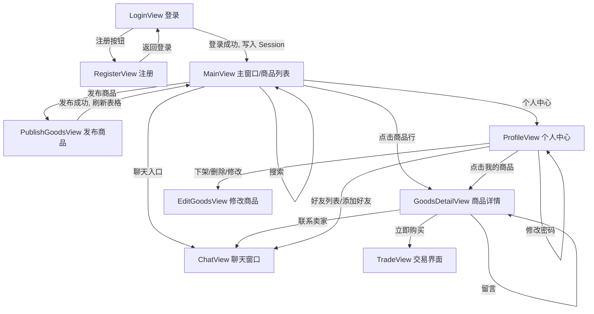

# 校园二手交易平台 —— 架构说明

> 一句话: 学生把闲置物品挂上来卖、别人来买，支持搜索/留言/聊天/交易。
> 本文件就是"架构说明书"，先看它再看代码。

技术栈: **JavaSE + Swing + JDBC + MySQL + Maven + Git**（没有 Spring、没有 MyBatis、没有 Socket，全部手写）

---

## 一、架构长什么样

架构 = 一个 Maven 项目文件夹 = **数据的设计 + 函数的声明**（函数体大部分留空，由组员分工实现）。

目前的状态：

- **已经写好实现的**（基础设施，直接用，别改）：`entity` 全部、`common` 全部、`util/DBUtil`、`Main`、各个界面的构造方法和 `initView()` 空架子。
- **还没有实现的**（组员分工写）：`dao/impl` 全部、`service` 全部、各个界面的按钮处理方法。
  未实现的方法统一写成：

  ```java
  throw new UnsupportedOperationException("待实现: UserService.login 负责人: 待分配");
  ```

  谁实现，就把 `负责人` 改成自己的名字，并且把这个 `throw` 换成真正的代码。

---

## 二、分层设计（核心）

```
view(视图层/表示层)  ->  service(业务层/逻辑层)  ->  dao(数据访问层)  ->  MySQL
                            ↑
                        entity(数据的设计) / common(状态枚举, 全局登录状态) / util(DBUtil)
```

| 层 | 包 | 负责什么 | 禁止什么 |
| --- | --- | --- | --- |
| view 视图层 | `view` | 界面展示、接收用户输入、弹提示、界面跳转 | 不写 SQL、不做业务判断 |
| service 业务层 | `service` | 核心逻辑判断、业务规则、事务 | 不弹窗、不接收输入、不打印输出，只用返回值告诉 view 结果 |
| dao 数据访问层 | `dao` + `dao/impl` | 用 JDBC 读写数据库，ResultSet 转对象 | 不做业务判断（"能不能删"是 service 的事） |
| entity 实体层 | `entity` | 数据的设计：一张表对应一个类 | 不加业务方法 |
| common 公共层 | `common` | 状态枚举、全局登录状态 `Session` | —— |
| util 工具层 | `util` | 数据库连接 `DBUtil` | —— |

**判断口诀**（写代码时纠结代码放哪，就问自己）：

- 只是界面展示 / 格式校验（密码框空不空、账号有没有超 10 位）→ **view**
- 要判断或修改数据库里的数据（账号是否已存在、密码对不对、这个商品能不能删）→ **service**
- 要写 SQL → **dao**
- 界面要用的数据从哪来？一律 `view` 调 `service`，`service` 调 `dao`，不要跳层。

**为什么要分层**：界面改样式（考核题界面换成别的界面）不会影响业务逻辑；一条业务规则只有一处实现，不会两个界面写得不一样。

---

## 三、目录结构

```
campus-flea-market/
├── pom.xml                      Maven 配置（只依赖 mysql-connector-java 一个包）
├── README.md                    本文件：架构说明
├── sql/flea_market.sql          建库建表 + 测试数据（MySQL 里先执行它）
└── src/main/
    ├── resources/db.properties  数据库账号密码（每人改自己的，已被 .gitignore 忽略）
    └── java/com/turing/flea/
        ├── Main.java            程序入口：启动登录界面
        ├── common/
        │   ├── GoodsStatus.java     商品状态枚举（在售/已售出/已下架/待处理）
        │   ├── TradeStatus.java     交易状态枚举（未支付/已完成/已取消/退货中/已退货）
        │   └── Session.java         全局登录状态（当前登录的是谁）
        ├── entity/              —— 数据的设计（6 张表 → 6 个类）
        │   ├── User.java            用户
        │   ├── Goods.java           商品
        │   ├── GoodsMessage.java    商品留言
        │   ├── Chat.java            聊天消息
        │   ├── Trade.java           交易
        │   └── Friend.java          好友关系
        ├── dao/                 —— 数据访问接口（只有函数的声明）
        │   ├── UserDao.java / GoodsDao.java / GoodsMessageDao.java
        │   ├── ChatDao.java / TradeDao.java / FriendDao.java
        │   └── impl/                接口的 JDBC 实现（组员写）
        ├── service/             —— 业务层（组员写）
        │   ├── UserService.java     注册/登录/信息修改/密码修改
        │   ├── GoodsService.java    浏览/搜索/详情/发布/修改/下架/删除/我的商品
        │   ├── GoodsMessageService.java  留言
        │   ├── ChatService.java     聊天
        │   ├── TradeService.java    交易
        │   └── FriendService.java   好友（拓展）
        └── view/                —— 界面（13 个 Swing 界面/弹窗）
            ├── LoginView.java       登录界面
            ├── RegisterView.java    注册界面
            ├── MainView.java        主窗口/商品列表（首页）
            ├── GoodsDetailView.java 商品详情界面
            ├── PublishGoodsView.java 发布商品界面
            ├── EditGoodsView.java   修改商品界面
            ├── ProfileView.java     个人中心界面
            ├── EditProfileDialog.java   修改个人信息弹窗
            ├── ChangePasswordDialog.java 修改密码弹窗
            ├── ChatView.java        聊天窗口界面
            ├── TradeView.java       交易界面
            ├── MyMessageView.java   我的留言管理界面（拓展）
            └── AddFriendDialog.java 添加好友弹窗（拓展）
```

---

## 四、界面与跳转（设计清晰）



文字版：

```
LoginView ──注册──> RegisterView ──返回──> LoginView
    └─登录成功──> MainView（首页）
                    ├─ 商品行点击 ──> GoodsDetailView
                    │                     ├─ 留言 ──> 刷新留言区
                    │                     ├─ 联系卖家 ──> ChatView
                    │                     └─ 立即购买 ──> TradeView
                    ├─ 搜索 ──> 刷新 JTable
                    ├─ 发布商品 ──> PublishGoodsView
                    ├─ 个人中心 ──> ProfileView
                    │                ├─ 修改信息 / 修改密码（两个弹窗）
                    │                ├─ 我的商品：下架 / 删除 / 修改(EditGoodsView)
                    │                ├─ 好友列表 / 添加好友（拓展）
                    │                └─ 我的留言（拓展）
                    └─ 聊天入口 ──> ChatView
```

界面跳转的写法（都在 view 里）：`new XxxView(...).setVisible(true)` 打开新窗口，`dispose()` 关掉自己。
**登录窗口关闭要把程序退掉**（`EXIT_ON_CLOSE`），其他窗口用 `DISPOSE_ON_CLOSE`。

---

## 五、数据的设计

### 5.1 数据库 6 张表（详见 `sql/flea_market.sql`）

| 表 | 存什么 | 关键字段 |
| --- | --- | --- |
| `user` | 用户 | `account` 唯一、`nickname` 昵称、`contact` 联系信息 |
| `goods` | 商品 | `price` 单位**分**、`image_path` 图片路径、`seller_id` 卖家、`status` 商品状态 |
| `goods_message` | 商品留言 | `goods_id`、`user_id` 留言人、`content` |
| `chat` | 聊天消息 | `send_id`/`recv_id`、`is_read` 已读标记 |
| `trade` | 交易 | `goods_id`/`buyer_id`/`seller_id`/`amount`/`status` |
| `friend` | 好友关系 | `user_id`/`friend_id`，唯一键防重复添加 |

### 5.2 三条要记住的数据约定

1. **金额一律用"分"存**（int）：9.90 元 = 990 分。
   界面显示 `price / 100.0` 保留两位小数；用户输入"元"时 `(int)(元 * 100)` 转成分。用 float/double 存钱会有精度误差。
2. **状态一律用枚举，不要在代码里写 1/2/3**：
   商品 `GoodsStatus`：1 在售 / 2 已售出 / 3 已下架 / 4 待处理（草稿）
   交易 `TradeStatus`：1 未支付 / 2 已完成 / 3 已取消 / 4 退货中 / 5 已退货
   数据库读出来用 `GoodsStatus.of(rs.getInt("status"))` 转成枚举，存进去用 `getCode()`。
3. **临时展示字段**：`Goods.sellerNickname`、`Chat.otherNickname`、`GoodsMessage.userNickname/goodsTitle`、`Trade.goodsTitle` 在数据库里**没有**这一列，是连表查出来给界面显示的，别写进 insert/update 的 SQL。

### 5.3 界面里用到的 Swing 组件 = 界面的数据设计

每个 View 类开头都有 `数据的设计` 注释块，把该界面用到的所有控件（JTable / JTextField / JButton / DefaultTableModel / Timer）都声明好了。
JTable 统一用 `DefaultTableModel`，加载数据 = 先 `setRowCount(0)` 清空，再 `addRow(new Object[]{...})` 一行行加。

---

## 六、关键业务规则（写代码前先看这几条）

1. **登录**：`UserService.login` 判断账号密码，成功由 view 写进 `Session.setCurrentUser(user)`，之后所有"当前是谁"都从 `Session` 取。
   账号/密码错误统一提示"账号或密码错误"，不要提示是账号错还是密码错。
2. **发布商品**：`sellerId = Session.currentUserId()`，`status = GoodsStatus.SALE`。
3. **交易与商品状态必须一起变，所以要用事务**（`TradeService.create` / `cancel` / `applyRefund`）：
   - 创建交易：`trade` 新增一条（未支付）+ `goods.status` 改成已售出
   - 取消交易：`trade` 改成已取消 + `goods.status` **恢复成在售**
   - 事务写法：`conn.setAutoCommit(false)` → 两句 SQL → `commit()`；出错 `rollback()`（模板见 `DBUtil` 与 `TradeService` 的类注释）
4. **删商品要拦一下**：有未结束交易的（未支付/退货中）不许删，返回 false，由界面提示。
5. **聊天不用 Socket**：聊天窗口用 `javax.swing.Timer` 每 3 秒调 `ChatService.pollUnread(我)`，
   显示完必须调 `markRead(我, 对方)`，否则同样的消息会被反复查出来重复显示。
6. **service 层不弹窗**：所有"成功/失败"用 boolean、null、返回对象表达，提示文字由 view 决定。

---

## 七、功能模块 → 类 对照表

| 需求模块 | 界面 | 业务 | 数据 |
| --- | --- | --- | --- |
| 用户：注册/登录 | LoginView、RegisterView | UserService | UserDao |
| 用户：个人信息/密码 | ProfileView、EditProfileDialog、ChangePasswordDialog | UserService | UserDao |
| 用户：好友（拓展） | ProfileView、AddFriendDialog | FriendService | FriendDao |
| 首页/商品：浏览、详情 | MainView、GoodsDetailView | GoodsService | GoodsDao |
| 商品：发布/修改/下架/删除/我的商品 | PublishGoodsView、EditGoodsView、ProfileView | GoodsService | GoodsDao |
| 商品状态管理（在售/已售出/已下架/待处理） | —— | GoodsStatus + GoodsService | goods.status |
| 搜索 | MainView 搜索框 | GoodsService.search | GoodsDao.searchOnSale |
| 聊天：单聊/监听/记录/提示 | ChatView、MainView | ChatService | ChatDao |
| 交易：创建/取消/完成/退货 | TradeView | TradeService | TradeDao |
| 留言（拓展） | GoodsDetailView、MyMessageView | GoodsMessageService | GoodsMessageDao |

---

## 八、分工建议

架构已经拆到"一人负责一条主线"，按下面分，每个人都能独立跑通一条流程：

| 角色 | 负责的类 | 说明 |
| --- | --- | --- |
| 技术官（架构负责人） | 本 README、数据库脚本、`DBUtil`、`Session`、公共类；每天整合代码 | 已实现，负责维护架构不被乱改 |
| 组员 A | UserDaoImpl、UserService、LoginView、RegisterView | 登录注册主线 |
| 组员 B | GoodsDaoImpl、GoodsService、MainView、PublishGoodsView | 首页 + 发布 |
| 组员 C | GoodsDetailView、EditGoodsView、GoodsMessageDaoImpl、GoodsMessageService、MyMessageView | 详情 + 留言 |
| 组员 D | ChatDaoImpl、ChatService、ChatView | 聊天主线 |
| 组员 E | TradeDaoImpl、TradeService、TradeView | 交易主线 |
| 组员 F | ProfileView、EditProfileDialog、ChangePasswordDialog | 个人中心 |
| 拓展组 | FriendDaoImpl、FriendService、AddFriendDialog、MainView 里的消息提示 | 核心跑通后再开工 |

分工约定：

- **一个人一个类**，不要两个人同时改同一个文件（会冲突）。
- 需要别人提供新函数时，先找架构负责人加"函数的声明"（注释 + 空实现），再由对应负责人实现，**不要直接去改别人的类**。
- 先做核心、再写拓展；核心流程（登录 → 发布 → 浏览 → 搜索 → 聊天 → 交易 → 个人商品管理）跑通后再加留言/好友/消息提示/退货。

---

## 九、环境搭建与运行

1. 安装 JDK（8 及以上）、IDEA（社区版即可）、MySQL（5.7 / 8.0）。
2. 在 MySQL 里执行 `sql/flea_market.sql`（会创建库 `flea_market`、6 张表和几条测试数据）。
3. 克隆仓库并切出自己的开发分支（分支怎么用见第十节第 7 条）：
   ```
   git clone https://github.com/wpy1452/campus-second-hand-trading-platform.git
   cd campus-second-hand-trading-platform
   git switch -c dev-你的名字 origin/dev
   ```
4. 用 IDEA 以 **Maven 项目** 打开克隆下来的文件夹（**不要自己新建项目再把代码贴过去**，否则环境不统一）。
5. 复制 `src/main/resources/db.properties.example` 为同目录下的 `db.properties`，把里面的 `jdbc.username` / `jdbc.password` 改成你自己 MySQL 的账号密码。

   克隆下来**没有** `db.properties` —— 它被 `.gitignore` 忽略了，只存在各人本地，不提交到仓库。所以这一步必须做，跳过会启动失败并报 `初始化数据库配置失败`。
6. 运行 `com.turing.flea.Main` 的 main 方法，就会弹出登录界面。
7. 命令行打包运行：
   ```
   mvn clean package
   java -jar target/campus-flea-market.jar
   ```
   （`pom.xml` 里 JDK 版本默认写的是 1.8，如果你们用的是 11/17/25，把 `maven.compiler.source/target` 改成对应版本）

测试账号：`xiaoming / 123456`、`xiaohong / 123456`。

---

## 十、开发规范

1. **注释格式**（架构里每个函数都按这个写，实现完保持不删）：
   ```java
   /**
    * 负责人: 张三
    * 功能: 这个函数做什么，写清楚分几步、调用了哪个 dao/service
    * 参数: 每个参数是什么意思
    * 返回值: 什么情况返回什么
    */
   ```
   标准只有一个：**组员能看懂**。
2. **实现一个函数 = 三件事**：把 `负责人` 改成自己的名字 → 删掉 `throw new UnsupportedOperationException(...)` → 写真正的代码（并保留注释）。
3. 命名：类名 `大驼峰`，方法/变量 `小驼峰`，常量 `全大写`；数据库字段用 `下划线`。
4. 一个函数只做一件事，超过 50 行基本就该拆了。
5. **不要跨层**：view 里不出现 SQL，service 里不出现 `JOptionPane`，dao 里不出现业务判断。
6. **每天整合代码**：写完一个函数就 push 到自己的分支，走 PR 合回 `dev`，别攒到最后。
   合并时最容易暴露问题（函数名被自己改了、参数返回值对不上、SQL 写错），
   早暴露比最后一天暴露好。开会时技术官屏幕共享 review 大家的 PR。
7. **Git 分支**（三条长期分支，别搞混）：
   - `main` —— 稳定基线，**开发期间谁都不要碰**，只在结项时由技术官把 `dev` 合进来。
   - `arch` —— 架构骨架的存档，**冻结**，只作参照，不改也不用管。
   - `dev` —— **开发集成分支**（仓库默认分支），所有人的成果都往这里合。

   每人从 `dev` 切一条自己的分支，只在自己的分支上写：

   ```
   git switch -c dev-你的名字 origin/dev      # 开局切一次
   git add .
   git commit -m "完成 UserService.login"    # 写完一个函数就提交
   git push -u origin dev-你的名字           # 第一次要 -u，之后直接 git push
   ```

   写完走 PR 合回 `dev`。**第二天开工前先同步别人的进度**，否则拖到最后一天会合不动：

   ```
   git fetch origin
   git merge origin/dev
   ```

   不要直接往 `main` 或 `dev` 上推，也不要把 `db.properties` 提交上去。

---

## 十一、功能优先级（照这个顺序做）

| 优先级 | 功能 |
| --- | --- |
| 核心（先做，必须跑通） | 注册、登录、发布商品、浏览商品列表、商品搜索、商品详情、我的商品管理（下架/删除/修改）、聊天（发送/接收/记录）、交易创建与取消 |
| 非核心 | 菜单界面、个人信息修改、密码修改 |
| 拓展（核心跑通再做） | 留言流程、好友添加/好友列表、交易完成/退货/推送、消息提示、草稿箱、收藏/推荐 |

---

## 十二、现在可以开始的地方

按这个顺序开工，今天就能看到东西：

1. `sql/flea_market.sql` 跑一遍，`db.properties` 改好 —— 保证数据库能连上。
2. 每人认领第八节表格里自己那一行的类。
3. 先写 `dao/impl` 里的方法（最独立，照着接口注释里的 SQL 写），再写 `service`，最后写 `view` 的按钮方法。
4. 每写完一个函数，就把界面接上去点一点，别攒到最后一起测。